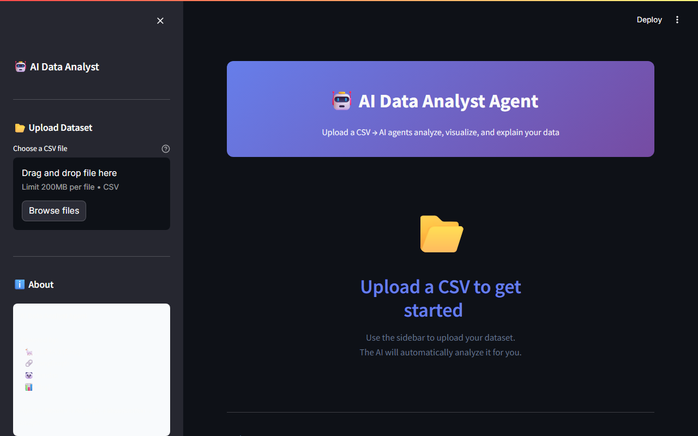
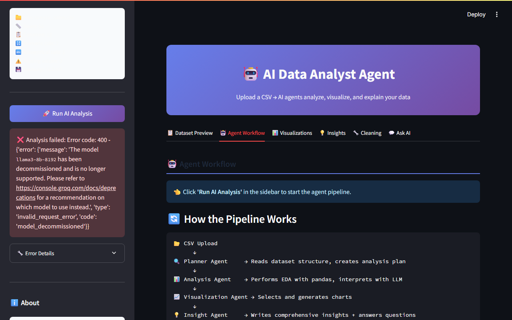
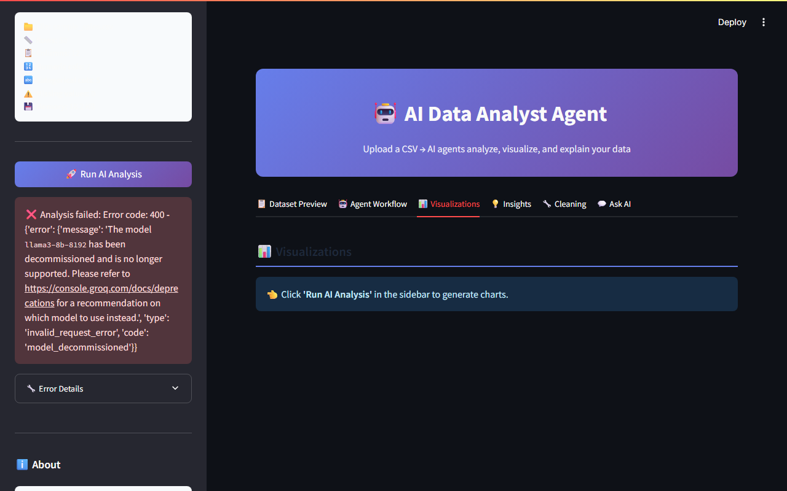
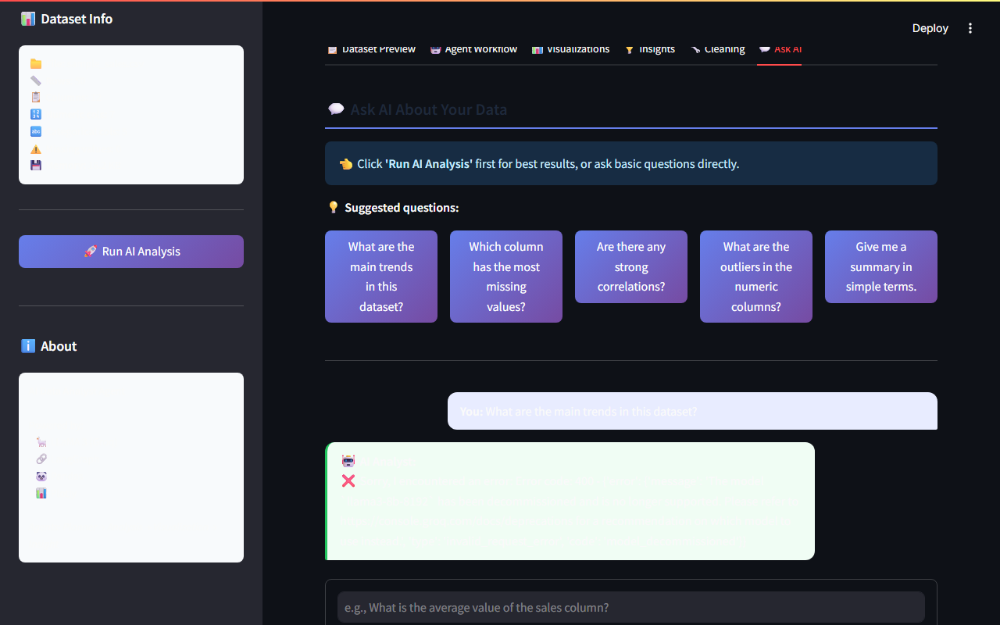

# 🤖 AI Data Analyst Agent

> An autonomous, multi-agent AI system that analyzes CSV datasets, generates insights, creates visualizations, and answers natural language questions — all powered by LLaMA 3 via Groq.


---

## 📸 Screenshots

> Upload → Run Analysis → Explore insights, charts, and ask questions in plain English.

| Dashboard & Upload | AI Agent Workflow |
|:---:|:---:|
|  |  |

| AI Visualizations | Chat Interface |
|:---:|:---:|
|  |  |

---

## 🌟 What This Project Does

This project is a **mini autonomous data analyst**. You upload a CSV file, and a pipeline of AI agents automatically:

1. **Plans** — The Planner Agent reads the dataset structure and creates a custom analysis plan
2. **Analyzes** — The Analysis Agent performs EDA (Exploratory Data Analysis) using pandas and interprets results with LLM
3. **Visualizes** — The Visualization Agent decides which charts to generate and creates them
4. **Generates Insights** — The Insight Agent writes a professional narrative report
5. **Answers Questions** — You can chat with the AI about your data using natural language

---

## 🏗️ Architecture

```
CSV Upload
    ↓
┌─────────────────────────────────────────────┐
│              LangGraph Pipeline             │
│                                             │
│  [Planner Agent]  → Creates analysis plan  │
│         ↓                                  │
│  [Analysis Agent] → EDA + LLM insights     │
│         ↓                                  │
│  [Visualization Agent] → Charts            │
│         ↓                                  │
│  [Insight Agent]  → Report + Q&A           │
└─────────────────────────────────────────────┘
    ↓
Streamlit UI (6 tabs)
```

**State flow**: Each agent reads shared state → adds its output → passes enriched state to the next agent.

---

## 🗂️ Project Structure

```
ai_data_analyst_agent/
│
├── app.py                    # Main Streamlit UI (entry point)
│
├── agents/                   # AI Agent modules
│   ├── __init__.py
│   ├── llm_client.py         # Groq LLM connection
│   ├── planner_agent.py      # Plans the analysis
│   ├── analysis_agent.py     # EDA + interpretation
│   ├── visualization_agent.py# Chart generation logic
│   ├── insight_agent.py      # Insights + Q&A with memory
│   └── workflow.py           # LangGraph orchestration
│
├── utils/                    # Helper utilities
│   ├── __init__.py
│   ├── config.py             # Environment variable loader
│   ├── data_loader.py        # CSV loading + dataset summary
│   └── charts.py             # Plotly chart functions
│
├── data/                     # Sample datasets
│   └── sample_sales.csv
│
├── .env                      # API keys (NOT committed to git)
├── .gitignore
├── requirements.txt
└── README.md
```

---

## ⚡ Quick Start

### 1. Clone the repository

```bash
git clone https://github.com/yourusername/ai-data-analyst-agent.git
cd ai-data-analyst-agent
```

### 2. Create a virtual environment

```bash
# Windows
python -m venv venv
venv\Scripts\activate

# macOS/Linux
python -m venv venv
source venv/bin/activate
```

### 3. Install dependencies

```bash
pip install -r requirements.txt
```

### 4. Set up your API key

```bash
# Copy the template
cp .env.example .env   # or just edit .env directly
```

Edit `.env` and add your key:
```
GROQ_API_KEY=your_key_here
```

**Get a free Groq API key** at [console.groq.com](https://console.groq.com/) — no credit card required.

### 5. Run the app

```bash
streamlit run app.py
```

Open your browser at **http://localhost:8501**

---

## 🎯 Features

| Feature | Description |
|---------|-------------|
| 📂 **CSV Upload** | Drag-and-drop any CSV file |
| 📋 **Dataset Preview** | View data, stats, column types |
| 🔍 **Planner Agent** | AI creates a custom analysis plan |
| 📊 **Auto EDA** | Pandas-powered statistics (no hallucination) |
| 📈 **Smart Charts** | Histograms, heatmaps, bar charts, scatter matrix |
| 💡 **AI Insights** | Executive-level narrative report |
| 🔧 **Cleaning Suggestions** | Rule-based + AI-generated recommendations |
| 💬 **Natural Language Q&A** | Chat with your data, with memory |

---

## 🤖 Agent Details

### Planner Agent (`agents/planner_agent.py`)
- Reads dataset metadata (shape, columns, types)
- Uses LLM to create a custom, dataset-specific analysis plan
- Temperature: 0.2 (focused, deterministic)

### Analysis Agent (`agents/analysis_agent.py`)
- Computes EDA statistics with **pandas** (not LLM — avoids hallucination)
- Detects missing values, outliers, skewness, correlations
- Sends stats to LLM for natural language interpretation
- Generates rule-based cleaning suggestions

### Visualization Agent (`agents/visualization_agent.py`)
- Uses rule-based logic to decide which charts are appropriate
- Delegates chart creation to `utils/charts.py`
- Generates: histograms, correlation heatmap, bar charts, scatter matrix

### Insight Agent (`agents/insight_agent.py`)
- Writes a comprehensive markdown insight report
- Implements **conversational memory** for Q&A
- Keeps last 6 conversation turns as context (sliding window memory)

---

## 🛠️ Tech Stack

| Technology | Purpose |
|-----------|---------|
| **Streamlit** | Web UI |
| **LangGraph** | Agent workflow orchestration |
| **LangChain** | LLM interaction primitives |
| **Groq + LLaMA 3** | LLM (free, fast) |
| **Pandas + NumPy** | Data processing |
| **Plotly** | Interactive charts |
| **Python-dotenv** | Environment management |

---

## 🔮 Future Improvements

- [ ] **SQL Agent** — Connect to a database and query with natural language
- [ ] **PDF Report Export** — Download the full analysis as a PDF
- [ ] **AutoML Integration** — Suggest and train ML models on the dataset
- [ ] **Multi-file Support** — Analyze and join multiple datasets
- [ ] **Scheduled Analysis** — Auto-analyze new CSV files on a schedule
- [ ] **Voice Input** — Ask questions via speech

---

## 💼 Resume / Portfolio

This project demonstrates:
- **Agentic AI architecture** — multi-agent pipeline with LangGraph
- **LLM integration** — prompt engineering, tool-augmented reasoning
- **Data engineering** — pandas EDA, data quality assessment
- **Full-stack Python** — Streamlit UI + backend agent logic
- **Production practices** — environment config, session state, error handling

---

## 📄 License

MIT License — feel free to use this for your portfolio.

---

*Built as an AI Engineer portfolio project | Powered by LangGraph + Groq*
